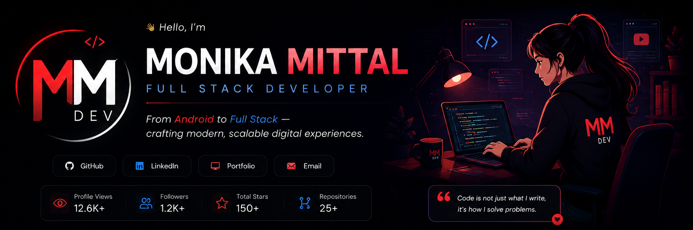

<div align="center">



<br/>

[](https://git.io/typing-svg)

<br/>


&nbsp;


</div>

---

## 🧑‍💻 About Me

```javascript
const developer = {
  name      : "Monika",
  role      : "Full Stack Developer",
  location  : "Bathinda, Punjab, India 📍",
  experience: "3+ years  (Android → MERN)",
  stack     : ["React", "Node.js", "Express", "MongoDB"],
  mobile    : ["Java", "Kotlin", "Android Studio"],
  tools     : ["Git", "GitHub", "VS Code", "Postman"],
  education : "MCA — Chitkara University (82.9%)",
  available : true   // 🟢 Open to Work
};
```

- 🔭 Currently building **ViewTube** — a full-stack MERN YouTube clone (Capstone)
- 🌱 Completed **Internshala Full Stack Development** programme · 5 certifications
- ⚡ Bridging **3+ years of Android** experience with the modern MERN stack
- 🏆 **1st Place** — C Programming Competition (2014)
- ⭐ **Top 3 Academic Ranker** — MCA Semesters & BCA Final Year
- 💬 Ask me about **React · Node.js · MongoDB · Android (Java/Kotlin)**
- 📫 Reach me at **monikagupta1728@gmail.com**

---

## 🚀 My Tech Journey

<div align="center">

| | Technology | Period |
|:-:|-----------|--------|
| 🤖 | **Android Development** | 2016 – 2019 |
| ☕ | **Java & Kotlin** | 2016 – 2019 |
| 🐘 | **PHP & Web Apps** | 2018 – 2019 |
| ⚛️ | **React.js** | 2026 – Present |
| 💚 | **Node.js & Express** | 2026 – Present |
| 🍃 | **MongoDB & MERN Stack** | 2026 – Present |

</div>

---

## 🛠️ Technologies & Tools

<div align="center">

### ⚛️ Frontend


### 🗄️ Backend


### 📱 Mobile


### 🛠️ Tools


</div>

---

## 📊 GitHub Stats

<div align="center">
  
  &nbsp;
  
</div>

<div align="center">
  
</div>

---

## 📈 Contribution Graph

<div align="center">


</div>

---

## 📊 Profile Summary

<div align="center">


</div>

<div align="center">


&nbsp;


</div>

---

## 🏅 Achievements

<div align="center">


</div>

---

## 🎯 2026 Goals

<div align="center">

| Goal | Status |
|------|--------|
| ✅ Complete Internshala Full Stack Programme | Done |
| ✅ Build ViewTube MERN Capstone | Done |
| ✅ Deploy SkyMist Weather App | Done |
| 🔄 Land First Full Stack Developer Role | In Progress |
| 🔄 Build & Deploy Portfolio Website | In Progress |
| ⏳ Contribute to Open Source | Coming Soon |
| ⏳ Learn TypeScript | Coming Soon |

</div>

---

## 🎓 Internshala Certifications

> ✅ Issued by **Internshala Trainings** · Signed by **Sarvesh Agrawal**, Founder & CEO
> 🔗 Verify at: [trainings.internshala.com/verify_certificate](https://trainings.internshala.com/verify_certificate)

<div align="center">

| Module | Cert No. | Issued |
|--------|----------|--------|
| 🌐 Designing Web Pages — HTML & CSS | `3o87c7jynbj` | Feb 07, 2026 |
| 🔀 Git and GitHub: Mastering Version Control | `6bkk3g8iyw7` | Mar 27, 2026 |
| ⚙️ Developing Interactive Websites — JavaScript | `45syw8p98xg` | Apr 12, 2026 |
| ⚛️ Building Modern Web Apps — React | `xkc4r5rpl8_` | Jun 04, 2026 |
| 🗄️ Mastering Node.js, Express.js & MongoDB | `j62ao523pdx` | Jun 30, 2026 |

</div>

---

## 📌 Featured Projects

<div align="center">

| Project | Description | Stack |
|---------|-------------|-------|
| 🎬 **[ViewTube](https://github.com/monikamittaldev/ViewTube)** | Full-stack YouTube clone — video browsing, auth, comments, likes, channel management | React · Node · MongoDB · JWT |
| 🛒 **[ShoppyGlobe](https://github.com/monikamittaldev/ShoppyGlobe)** | E-commerce app with React/Redux frontend + Node/Express/MongoDB backend | React · Redux · Express · MongoDB |
| 📚 **[Online Library](https://github.com/monikamittaldev/Online-Library)** | Near-perfect scored Internshala assignment — book browsing & filtering | React · Redux Toolkit · Tailwind |
| 🌤️ **[SkyMist Weather](https://github.com/monikamittaldev/SkyMist-Weather)** | Real-time location-based weather app deployed on Netlify | JavaScript · Fetch API · Netlify |
| 🏫 **Digital School Management** | Production Android + PHP app — attendance, fees, student tracking | Java · Android · PHP · MySQL |
| 🏏 **iiiCricket** | Cricket tournament app with live scores & real-time media sharing | Java · Android · Real-time DB |

</div>

---

## 🤝 Connect with Me

<div align="center">

[](https://www.linkedin.com/in/monikamittal28)
[](https://www.instagram.com/monika94.ca)
[](https://github.com/monikamittaldev)
[](mailto:monikagupta1728@gmail.com)

</div>

---

<div align="center">

```
✨  Learning Continuously · Building with Purpose · Delivering with Quality  ✨
```


</div>